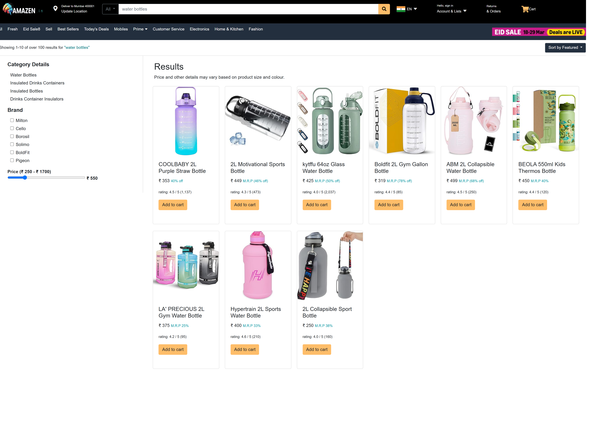

# Amazon Clone - Product List Page

A responsive UI clone of Amazon's product list page built with HTML, CSS, and minimal JavaScript. This project focuses on recreating the visual design and layout of Amazon's product listing page, with basic interactivity for demonstration purposes.



## Project Overview

This is primarily a frontend UI project that demonstrates my ability to:
- Recreate complex UI components from scratch
- Implement responsive design principles
- Structure HTML and CSS in a maintainable way
- Apply basic JavaScript for minimal interactivity

## Features

- Responsive header with search bar UI
- Category navigation bar
- Product filtering UI (brand checkboxes and price range slider)
- Product sorting dropdown UI
- Responsive product grid layout
- Product cards with images, prices, and ratings
- Basic "Add to Cart" functionality with notifications


## Technologies Used

- HTML5
- CSS3/SCSS
- JavaScript (ES6+) - Minimal usage for basic interactivity
- Bootstrap 4
- Font Awesome Icons
- Bootstrap Icons

## Project Structure

```
amazon_clone_product_list_page/
├── images/              # Product and UI images
├── css/                 # Compiled CSS files
├── scss/               # SCSS source files
├── js/                 # JavaScript files (minimal)
├── index.html          # Main HTML file
└── README.md           # Project documentation
```

## Setup and Installation

1. Clone the repository:
```bash
git clone https://github.com/Julnar1/amazon_clone_product_list_page.git
```

2. Open `index.html` in your browser to view the project.

## Note on Interactivity

This project is primarily focused on UI replication with minimal JavaScript functionality. The interactive elements (filters, sorting, cart) are implemented with basic JavaScript for demonstration purposes only. In a production environment, these would be connected to a backend API and database.

## Future Enhancements

If this project were to be expanded, the following features could be implemented:
- Full shopping cart functionality with a backend
- User authentication
- Product detail pages
- Checkout process
- Search functionality with API integration

## Contributing

Feel free to submit issues and enhancement requests.

## License

© 2025 Julnar Nabeel. All rights reserved.
